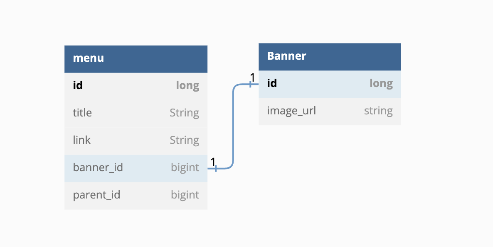

# SpringBoot-backend-project

## 1. 소개

> 무신사 글로벌개발팀 백엔드 개발 지원자 김가영의 프로젝트 입니다.

## 2. 개발환경
- API 개발 : Postman
- IDE : Intellij IDEA
- Git Tools : Github Desktop
- Spring Boot 3.0.2
- jdk17
- Gradle

### 2.1 의존성 추가
- H2 DataBase
  - 자바에 내장되어있는 인메모리 관계형 데이터베이스를 사용하여 더욱 편리한 환경을 구축하였습니다.
- Spring Data JPA(Hibernate)
  - JPA를 이용하여 데이터베이스의 접근을 최소화하여 성능을 높일수 있게 하였습니다.
- Lombok
  - 간결한 코드를 만들기 위해 롬복을 사용하여 코드를 구성하였습니다.
- Spring Web

## 3. 프로젝트 컨벤션

### 3.1 코드 컨벤션

- [Java 코드 컨벤션](https://github.com/woowacourse/woowacourse-docs/tree/master/styleguide/java) 가이드를 준수하며 프로그래밍하였습니다.

### 3.2 Git 컨벤션

> 히스토리 관리를 위해 커밋 이력을 상세하게 작성하였습니다.

### 3.2.1 

- Docs: 문서 관련 작업
- Update: 기존 코드 수정
- Feat: 기능구현, 새로운기능추가
- Fix: 버그수정, 오타수정및 호출제한적용
- Ref: 리팩토링
- Chore: 빌드업무수정, 패키지매니저 수정
- Style: 코드 포맷팅, 세미콜론 누락, 코드변경이없는경우
- Rename: 파일 혹은 폴더명을 수정하거나 옮기는 작업만 하는 경우
- Test: 테스트 추가, 테스트 리팩토링(프로덕션 코드 변경 x)

#### 예시 
```jsx
Feat: 하위메뉴 등록 구현
Chore: application.properties 프로파일 설정
```

## 4. 디렉토리 구조
> 각 도메인에 맞추어 패키지 생성 후 `controller`, `domain`, `dto`, `repository`, `service`, 로 구성하였습니다.
```javascript
.
├── README.md
├── docs
│   └── menu.png
├── gradle
│   └── wrapper
│       ├── gradle-wrapper.jar
│       └── gradle-wrapper.properties
├── build.gradle
├── gradlew
├── gradlew.bat
├── settings.gradle
├── .gitignore
└── src
    ├── main
    │   ├── java
    │   │   └── me
    │   │       └── gayoungkim
    │   │           ├── SpringBootBackendProjectApplication.java
    │   │           ├── banner
    │   │           │   ├── controller
    │   │           │   ├── domain
    │   │           │   │   └── Banner.java
    │   │           │   ├── dto
    │   │           │   │   └── BannerRequestDto.java
    │   │           │   ├── repository
    │   │           │   │   └── BannerRepository.java
    │   │           │   └── service
    │   │           ├── base
    │   │           │   └── error
    │   │           │       ├── ErrorCode.java
    │   │           │       ├── ErrorResponse.java
    │   │           │       ├── GlobalExceptionHandler.java
    │   │           │       └── exception
    │   │           │           ├── BadRequestException.java
    │   │           │           ├── CustomBaseException.java
    │   │           │           ├── MenuNotFoundException.java
    │   │           │           ├── MenuNotTopMenuException.java
    │   │           │           └── NotFoundException.java
    │   │           └── menu
    │   │               ├── controller
    │   │               │   └── MenuController.java
    │   │               ├── domain
    │   │               │   └── Menu.java
    │   │               ├── dto
    │   │               │   ├── MenuRequestDto.java
    │   │               │   ├── MenuResponseDto.java
    │   │               │   └── SubMenuRequestDto.java
    │   │               ├── repository
    │   │               │   └── MenuRepository.java
    │   │               └── service
    │   │                   └── MenuService.java
    │   └── resources
    │       └── application.properties
    └── test
        ├── java
        │   └── me
        │       └── gayoungkim
        │           └── menu
        │               └── controller
        │                   └── MenuControllerTest.java
        └── resources
```


## 5. 실행

### 프로젝트 실행
```
# git clone
$ git clone git@github.com:JUGGUM/springboot-backend-project.git

# 프로젝트 디렉터리로 이동
$ cd ./springboot-backend-project

# 빌드 및 실행
./gradlew build jar
java -jar build/libs/springboot-backend-project-1.0-SNAPSHOT.jar
```

## 6. API
- 웹의 장점을 최대한 활용하여 자원의 이름으로 구분해 자원의 상태를 주고받는 `REST API`(Representational State Transfer) 설계방식을 준수하여 설계하였습니다.
### API DOCUMENT

https://documenter.getpostman.com/view/24268540/2s946fdsBB

### 메뉴 등록 API
```
request:
POST : http://localhost:8080/api/menus

response:
{
    "id": 1, # menuId
    "title": "패션 소품", # 메뉴 타이틀
    "link": "www.musinsafashionitem.com", # 메뉴 링크
    "parent": null, # 상위 메뉴
    "banner": null, # 배너 정보
}
```

### 메뉴 수정 API
```
request:
PUT: http://localhost:8080/api/menus/{id}
(testmenuId : 1)

response:
response:
{
    "id": 1, # menuId
    "title": "원피스/스커트", # 메뉴 타이틀
    "link": "www.musinsaskirt.com", # 메뉴 링크
    "parent": null, # 상위 메뉴
    "banner": null, # 배너 정보
}
```

### 하위 메뉴등록 API
```
request:
http://localhost:8080/api/menus/{id}/submenus
(testmenuId : 1 [parent_id])

response:
{
    "id": 2, # 하위 메뉴 정보
    "title": "버킷/사파리햇",
    "link": "www.musinsabuckethat.com",
    "parent": { # 상위 메뉴 정보
        "id": 1,
        "title": "원피스/스커트",
        "link": "www.musinsaskirt.com",
        "parent": null,
        "banner": null,
        "topMenu": true
    },
    "banner": null,
    "topMenu": false
}
```

### 배너 등록 API
```
request:
http://localhost:8080/api/menus/{id}/banner
(testmenuId : 1 [parent_id])

response:
{
    "id": 1,
    "title": "원피스/스커트",
    "link": "www.musinsaskirt.com",
    "parent": null,
    "banner": {
        "id": 1,
        "imageUrl": "'좋아요' 브랜드 신상 위젯에서 보기!"
    },
    "topMenu": true
}
```

### 단일 메뉴 조회 API
```
request:
http://localhost:8080/api/menus/{id}
(testmenuId : 1 )

response:
{
    "id": 1,
    "title": "원피스/스커트",
    "link": "www.musinsaskirt.com",
    "subMenus": [
        {
            "id": 2,
            "title": "버킷/사파리햇",
            "link": "www.musinsabuckethat.com",
            "parent": {
                "id": 1,
                "title": "원피스/스커트",
                "link": "www.musinsaskirt.com",
                "parent": null,
                "banner": {
                    "id": 1,
                    "imageUrl": "'좋아요' 브랜드 신상 위젯에서 보기!"
                },
                "topMenu": true
            },
            "banner": null,
            "topMenu": false
        }
    ]
}
```

### 전체 메뉴조회 API
```
request:
http://localhost:8080/api/menus
```

### 하위 메뉴조회 API
```
request:
http://localhost:8080/api/menus/{id}/submenus
```

### 메뉴 삭제 API
```
request:
http://localhost:8080/api/menus/{id}
```


# 문제 해결 전략
## 7. 예외 처리
모든 예외는 적절한 CustomException을 만들어서 처리했고, 예외 코드(`ErrorCode`) 등을 추상화하여 일관적인 예외를 클라이언트에게 반환하도록 설계했습니다.
모든 예외는 ControllerAdvice가 잡아서 직접 정의한 `ErrorResposne`형식에 맞게 리턴합니다. 에러에 따라 응답이 바뀌는 상황을 만들지 않고 일관성을 지키기 위해 노력했습니다.

## 8. ERD


(구현의 편의를 위해 유저 테이블은 따로 생성하지 않았습니다.)

- menu
    - 메뉴를 등록하고 수정하고 삭제할수 있는 테이블
    - 메뉴에는 상위 메뉴를 표현하는 아이디인 (`parent_id`), 최상위 메뉴에만 등록할수있는 배너의 고유 아이디 (`banner_id`)에 대한 데이터가 들어있습니다.

- banner
    - 최상위 메뉴에는 배너를 등록하여 추가 노출 할 수있습니다.
    - 배너를 추가할때에는 최상위메뉴인지 확인을 한후 (`image_url`) 을 통해 배너의 이미지를 등록할 수 있습니다.

## 9. Test
- Junit 
  - 자바 단위 테스트를 위한 테스팅 프레임워크입니다.
- AssertJ
  - 자바 테스트를 돕기 위해 다양한 문법을 지원하는 라이브러리입니다.
  
- `given/when/then` 패턴으로 1개의 단위 테스트를 3가지 단계로 나누어 처리하는 패턴으로 작성하였습니다.
  - `given` : 테스트 실행을 준비하는 단계
  - `when`  : 테스트를 진행하는 단계
  - `then`  : 테스트결과를 검증하는 단계

## 10. 프로젝트 회고
백엔드 개발자는 비즈니스 확장성을 고려한 시스템과 인터페이스를 설계하고 구현하는 부분이 중요하다고 생각한다.
무신사 글로벌 개발팀에서도 이를 중요하게 여긴다고 느껴졌다.

처음 메뉴와 배너를 구성할 때 일대일과 일대다 관계에서 어떻게 구성하는 게 효율적일지 고민이 많았다. 확장성을 고려하면 일대다 관계라고 단순하게 생각할 수도 있겠지만
그렇다고 일대다가 정답이라고 느껴지지는 않았다. 관계로 확장성을 논하기에는 의미가 없어 보였고 결국 부모를 누구로 두냐가 더 큰 관점인 것 같았다.

클라이언트와 서버가 데이터를 주고받기에 최적의 URL 설계 규칙인 REST API로 이번에도 설계를 진행하였다. 역시나 한눈에 알아보기도 쉬웠고 테스트를 진행하기에 수월해서 효율적이었던 것 같다.

실제로 무신사를 살펴보면 이번 과제와 비슷한 부분들이 존재하는데 실제 서비스에 구현되어 있는 부분을 과제로 진행할 수 있어서 상당히 흥미로웠고 개발에 몰두하기도 쉬웠던 것 같다.
개발의 즐거움은 끝이 보이지 않는 배움인 것 같다. 이러한 즐거움을 유지하며 부족한 부분들을 앞으로 채워나가야겠다. 
